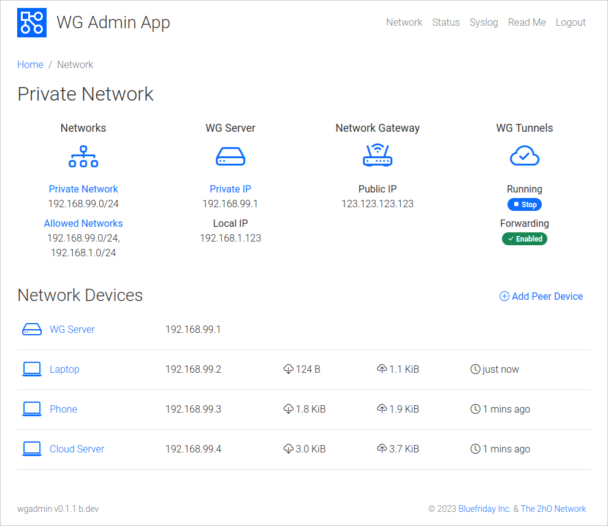

# WireGuard Admin App
**Turn a Raspberry Pi into a simple WireGuard&trade; VPN Appliance**

WGAdmin is a free tool that converts a Raspberry Pi single-board computer into an easy-to-use WireGuard VPN Appliance. WGAdmin allows you to create, configure, and manage a simple WireGuard network without messing around with configuration files.



# How it Works

Architecturally, WGAdmin is a configuration management layer wrapped around the standard WireGuard software. It's the missing WireGuard GUI and config generator. Security and heavy lifting is handled by WireGuard natively.

WGAdmin needs to run as a daemon. WGAdmin will be responsible for starting and stopping the WireGuard tunnels. 
i.e. You do not install `wg-quick@wg0` etc. 
It is possible to use `wg-quick` for other tunnels that are separate from 
the interface managed by WGAdmin. e.g. let WGAdmin manage `wg0` and `wg-quick` manage `wg1` etc.
  
By default, WGAdmin listens on 0.0.0.0:8000 but you can change this manually in the `/etc/wgadmin.json` config file.

## Debian Based Installation (Debian, Ubuntu, Mint, etc)

WGAdmin is available prepackaged as `.deb` files below. 
- [wgadmin_0.1.1_arm64.deb](https://dist.2ho.ca/dist/wgadmin/wgadmin_0.1.1_arm64.deb) (ARM 64bit)
- [wgadmin_0.1.1_arm64.deb](https://dist.2ho.ca/dist/wgadmin/wgadmin_0.1.1_armhf.deb) (ARM 32bit)
- [wgadmin_0.1.1_arm64.deb](https://dist.2ho.ca/dist/wgadmin/wgadmin_0.1.1_amd64.deb) (AMD 64bit)

The packages are very simple and it can also be installed manually if you prefer.

## Generic Linux Installation (non-Debian based)

To install on other distributions...

Be sure the dependancies are satisfied.
- Requires a recent kernel with WireGuard included (5.6+)
- or WireGuard installed separately (`apt install wireguard` etc.)
- optionally install `wireguard-tools`

Download the appropriate `wgadmin` binary for your architecture and place is in `/usr/local/bin`
- [wgadmin](https://dist.2ho.ca/dist/wgadmin/arm64/wgadmin) (ARM 64bit)
- [wgadmin](https://dist.2ho.ca/dist/wgadmin/armhf/wgadmin) (ARM 32bit)
- [wgadmin](https://dist.2ho.ca/dist/wgadmin/amd64/wgadmin) (AMD 64bit)

Download the `wgadmin.service` file and place it in `/lib/systemd/system`
- [wgadmin.service](https://dist.2ho.ca/dist/wgadmin/wgadmin.service)

Enable and start it
```
sudo chown root:root /usr/local/bin/wgadmin
sudo chmod 755       /usr/local/bin/wgadmin
sudo systemctl daemon-reload
sudo systemctl enable wgadmin.service
sudo systemctl start wgadmin.service
```
    
# Additional Manual Configuration 
### (required regardless of install method)

There are a few additional things that need to be configured manually before WireGuard can work on your network.

## Enable IP Forwarding on this device

If you want to reach other devices on your home network, you must enable IP Forwarding.

Check to see if forwarding is enabled (1 = enabled, 0 = disabled). At a Linux command prompt...

```
$ sysctl net.ipv4.ip_forward
net.ipv4.ip_forward = 0
```

To enable...

```
$ sudo -i
password: ********
# echo net.ipv4.ip_forward = 1 > /etc/sysctl.d/98-wgadmin.conf
# sysctl -p /etc/sysctl.d/98-wgadmin.conf
net.ipv4.ip_forward = 1
# exit
```

## Enable NAT Masquerading on this device

If you want to use this device as a gateway to route all traffic beyond your home network, you must set up Masquerading.

`Instructions to follow...`

## Add a Static Route on your Gateway

In order for return traffic on your network to find its way back to remote peers, you need to set up a static route on the network's gateway. If you just want to reach devices on your home network, this is not necessary.

Add a static route on the network's default gateway as follows: (examples, depending on your type of router):
(where 192.168.1.99 is the address of the wgadmin device)

```
Destination: 192.168.99.0/24 Next hop: 192.168.1.99 (server device)

ip route add 192.168.99.0/24 via 192.168.1.99
route add dest 192.168.99.0 mask 255.255.255.0 gateway 192.168.1.99 metric 1
```

## Port Forward WireGuard on your Gateway

WireGuard traffic from outside needs to be able to reach this device.

Forward all external WireGuard connections from the Internet to this device. (example, depending on your type of router):

```
From: Any Port: 51821 To: 192.168.1.99 Port: 51821 Protocol: UDP
```

## Configure a Dynamic DNS name

If you do not have a static IP address from your Internet provider, you will need a name to refer back to this network's gateway.

It's best to set up a Dynamic DNS name for your gateway. This way nothing will need to be reconfigured if your address changes.

## Additional Manual Configuration

The wgadmin app keeps its configuration in /etc/wgadmin.json. There are several additional user changeable parameters that are not represented in the GUI. Be sure to stop the wgadmin service before making changes or they risk being overwritten.

<dl>
  <dt>WgInterface</dt>
  <dd>The WireGuard interface name. Defaults to `wg0`.</dd>
  <dt>HttpListen</dt>
  <dd>The IP and Port running the Web GUI. Defaults to 0.0.0.0:8000. Note: 0.0.0.0 means listen on all interfaces. The app runs as root so ports below 1024 are possible if they are free. e.g. 80</dd>
  <dt>Username</dt>
  <dd>A blank username will trigger the initialization page. Here you can create a new Username and Password. i.e. This is how you reset a forgotten password. Edit the Username field and set it to `"Username": "",`</dd>
  <dt>Password</dt>
  <dd>This stores a bcrypt hash of the password. Setting it to blank will trigger the initialization page as above.</dd>
</dl>
